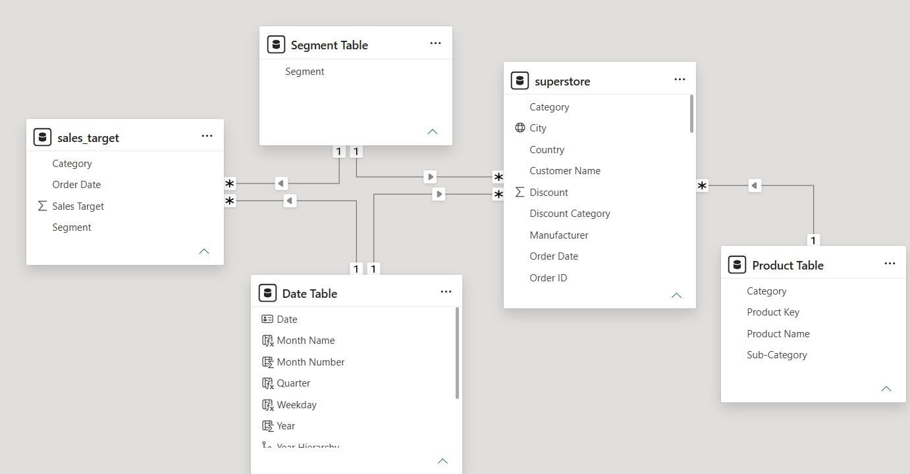
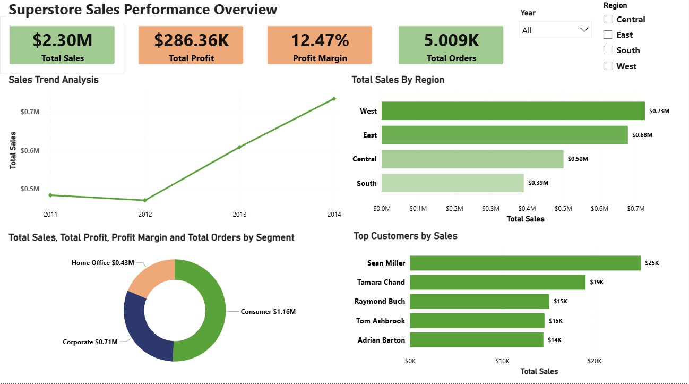
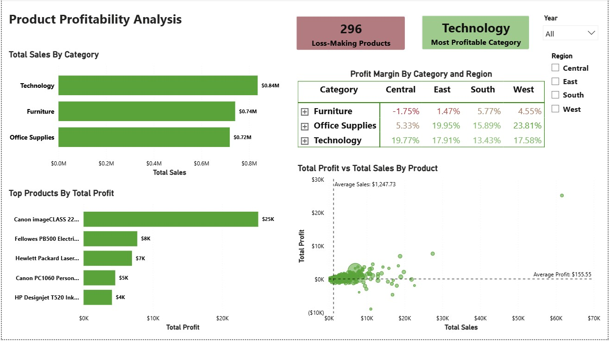
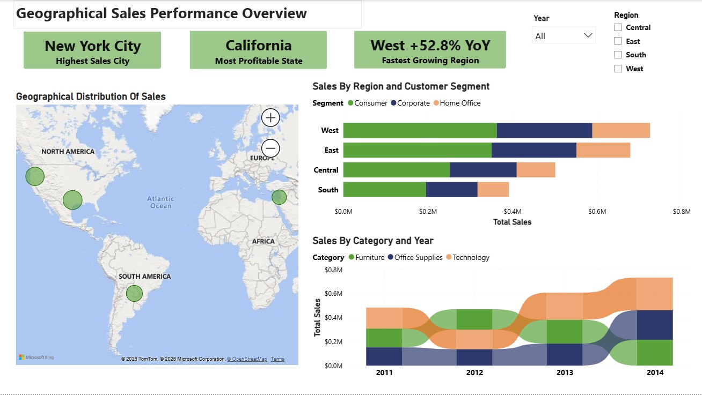
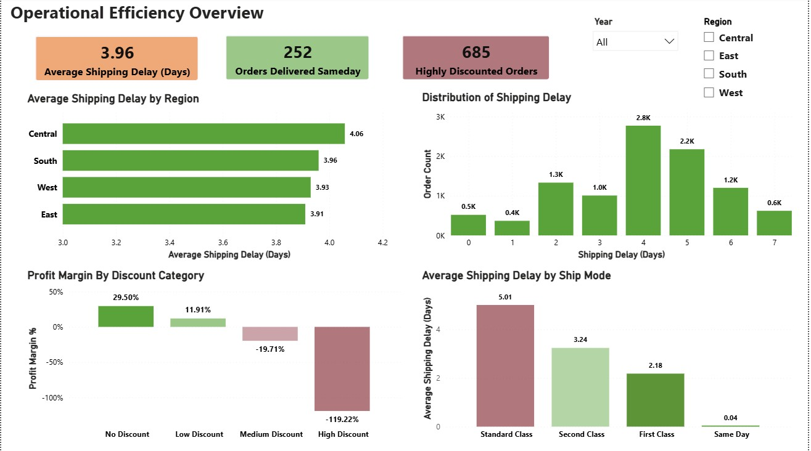
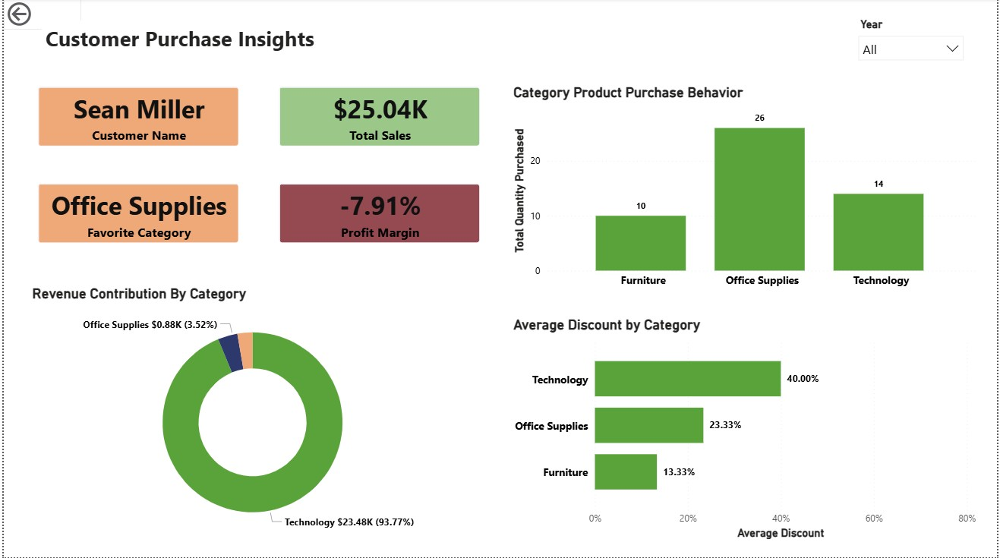

# 🛒 Superstore Sales Analysis — Power BI Case Study

## Business Problem

> **How can a retail company improve profitability, sales performance, and operational efficiency across products, customer segments, and regions?**

This project analyzes four years (2011–2014) of Superstore sales data across 5 interactive Power BI dashboards, each targeting a distinct dimension of business performance.

---

## 📁 Dataset

**Source:** [Kaggle — Superstore Sales Dataset](https://www.kaggle.com/)

| Table | Rows | Features | Key Fields |
|---|---|---|---|
| Superstore Sales | ~10,000 | 21 | Order ID, Order Date, Ship Date, Customer Name, Segment, Region, City, Category, Sub-Category, Product Name, Sales, Profit, Discount, Quantity |
| Sales Target | ~4,600 | 4 | Category, Segment, Order Date, Sales Target |

---

## 🧹 Data Cleaning & Transformation (Power Query)

- Changed `Sales` and `Profit` from whole number to **currency** data type
- Converted `Order Date` and `Ship Date` from **text to Date** type
- Standardized text columns (`Category`, `Sub-Category`, `Product Name`) to **Proper Case** and trimmed extra whitespace
- Verified **no null values** using Column Profile; removed **duplicate rows**
- Validated numerical columns (`Sales`, `Profit`, `Discount`) for anomalies — confirmed all values are realistic
- Dropped the redundant `Number of Records` column (constant value of 1)
- Engineered a **Shipping Days** column using M language `Duration` function
- Bucketed transactions into **Profit Categories**: Loss Making | Low Profit | Medium Profit | High Profit
- Created **Discount Categories**: No Discount (0%) | Low (0–20%) | Medium (20–50%) | High (50–80%)
- Built **Geographical Hierarchy** (Region → State → City) and **Category Hierarchy** (Category → Sub-Category → Product Name) to enable drill-down
- Generated a **unique Product Key** by concatenating Product Name + Category + Sub-Category to resolve products listed under multiple sub-categories

---

## 🗂️ Data Model

A **Star Schema** was configured in Power BI Model View with one central fact table and three dimension tables.



### Dimension Tables Created

**Date Table**
```dax
Date Table = CALENDAR(MIN(superstore[Order Date]), MAX(superstore[Order Date]))
```
Extended with: `Year`, `Month Name`, `Month Number`, `Quarter`, `Weekday` — enables reliable Time Intelligence functions.

**Product Table**
```dax
Product Table =
DISTINCT(
    SELECTCOLUMNS(
        superstore,
        "Product Key", superstore[Product Key],
        "Product Name", superstore[Product Name],
        "Category", superstore[Category],
        "Sub-Category", superstore[Sub-Category]
    )
)
```

**Segment Table** — unified across both fact tables so one slicer filters both:
```dax
Segment Table =
DISTINCT(
    UNION(
        SELECTCOLUMNS(superstore, "Segment", superstore[Segment]),
        SELECTCOLUMNS(sales_target, "Segment", sales_target[Segment])
    )
)
```

---

## 📐 DAX Measures

```dax
-- Core KPIs
Total Sales = SUM(superstore[Sales])
Total Profit = SUM(superstore[Profit])
Profit Margin % = DIVIDE([Total Profit], [Total Sales], 0)

-- Year-over-Year Growth
Sales YoY % =
VAR SalesPreviousYear =
    CALCULATE([Total Sales], SAMEPERIODLASTYEAR('Date Table'[Date]))
RETURN
    DIVIDE([Total Sales] - SalesPreviousYear, SalesPreviousYear)

-- Product Health
Loss-Making Products Count =
COUNTROWS(
    FILTER(
        VALUES(superstore[Product Name]),
        [Total Profit] < 0
    )
)

-- Dynamic KPI Card
Highest Sales City =
CONCATENATEX(
    TOPN(1, VALUES(superstore[City]), [Total Sales], DESC),
    superstore[City]
)
```

---

## 📊 Dashboards

### 1. Sales Overview


**Key Insights:**
- Total sales of **$2.30M** with **$286K profit** at **12.47% margin** over 4 years
- **West** leads with $0.73M in sales; **South** is the weakest at $0.39M
- **2014** was the strongest year; **2012** saw a dip
- **Consumer** segment dominates sales at $1.16M vs Corporate ($0.71M) and Home Office ($0.43M)
- **Sean Miller** tops customer sales at $25K — but carries a negative profit margin (see Customer Insights)

**Interactive Features:** Drill-down on Sales Trend (Year → Quarter → Month) | Drill-down on Regional Sales (Region → State → City) | Drill-through to Customer Insights | Synced slicers across all dashboards

---

### 2. Product Analysis


**Key Insights:**
- All three categories are competitive in sales — Technology leads narrowly at **$0.84M**
- **296 out of 1,850 products are loss-making** (~16% of the portfolio)
- **Furniture** has a **negative margin in the Central region (-1.75%)** — the only category-region combination in the red
- **Technology** achieves the best margin in the Central region (19.77%); **Office Supplies** leads in all other regions
- Scatter plot reveals a cluster of high-sales / low-profit products — a priority area for margin improvement

**Interactive Features:** Drill-down from Category → Sub-Category | Scatter plot with average reference lines creating performance quadrants

---

### 3. Regional Sales Analysis


**Key Insights:**
- **New York City** is the highest-grossing city; **California** is the most profitable state
- **West** is the fastest-growing region at **+52.8% YoY**
- Consumer segment holds the largest share across all four regions
- **Technology** ranked first in all years except 2012; **Furniture** sales are declining from 2012 onward

**Interactive Features:** Map drill-down (Region → State → City) | Stacked bar drill-down (Region → State)

---

### 4. Operational Efficiency


**Key Insights:**
- Average shipping delay is **3.96 days**; **Central** region has the worst delay at 4.06 days
- **Standard Class** is the slowest ship mode at 5.01 days average
- **685 orders carry discounts above 50%**, resulting in a **–119.22% profit margin** — the single largest profitability risk
- Orders with **no discount** yield a 29.50% margin; this drops sharply as discounting increases

---

### 5. Customer Insights *(Drill-Through Page)*


Accessible via right-click drill-through from the Top Customers chart on the Sales Overview dashboard.

**Key Insights (Sean Miller — Top Customer):**
- Highest total sales at **$25.04K** but a **–7.91% profit margin overall**
- **Technology** drives 93.77% of his revenue but carries a **40% average discount**, erasing profitability
- Office Supplies has the most items ordered (26) but contributes only 3.52% of revenue — high volume, low value

---

## 💡 Key Business Insights & Recommendations

| # | Finding | Recommendation |
|---|---|---|
| 1 | **High-discount orders (>50%) generate –119% profit margin** | Implement a discount approval policy with a hard cap around 30–40%; re-evaluate pricing strategy for these SKUs |
| 2 | **296 products are loss-making (~16% of portfolio)** | Audit bottom-performing SKUs — discontinue or reprice products that have no path to profitability |
| 3 | **Furniture is margin-negative in the Central region (–1.75%)** | Investigate region-specific cost drivers (logistics, returns, discounting) and adjust pricing or fulfillment strategy |
| 4 | **West region growing at +52.8% YoY** | Prioritize inventory, staffing, and marketing investment in the West to sustain momentum |
| 5 | **Top customer (Sean Miller) is unprofitable** | High-value customers with negative margins represent a systemic risk — introduce customer-level profitability tracking and restructure discount agreements |
| 6 | **Standard Class shipping averages 5 days; Central has the worst delays** | Audit Central region logistics partners; consider incentivizing customers to use First Class (2.18 days) for time-sensitive orders |
| 7 | **Furniture sales declining from 2012 onward** | Reassess the Furniture product mix, supplier pricing, and category positioning; the declining trend combined with margin issues signals a structural problem |
| 8 | **Technology has the strongest margins in Central (19.77%)** | Shift marketing and sales focus toward Technology in Central, where it outperforms Furniture significantly |

---

## 🛠️ Tools & Technologies


---

## 📂 Repository Structure

```
├── Superstore_Sales.pbix       # Power BI report file
├── data/
│   └── superstore_sales.xlsx   # Source dataset
├── images/                     # Dashboard screenshots
│   ├── data_model.png
│   ├── sales_overview.png
│   ├── product_analysis.png
│   ├── regional_sales.png
│   ├── operational_efficiency.png
│   └── customer_insights.png
└── README.md
```

---

*Dataset sourced from Kaggle. Project built independently for portfolio purposes.*
